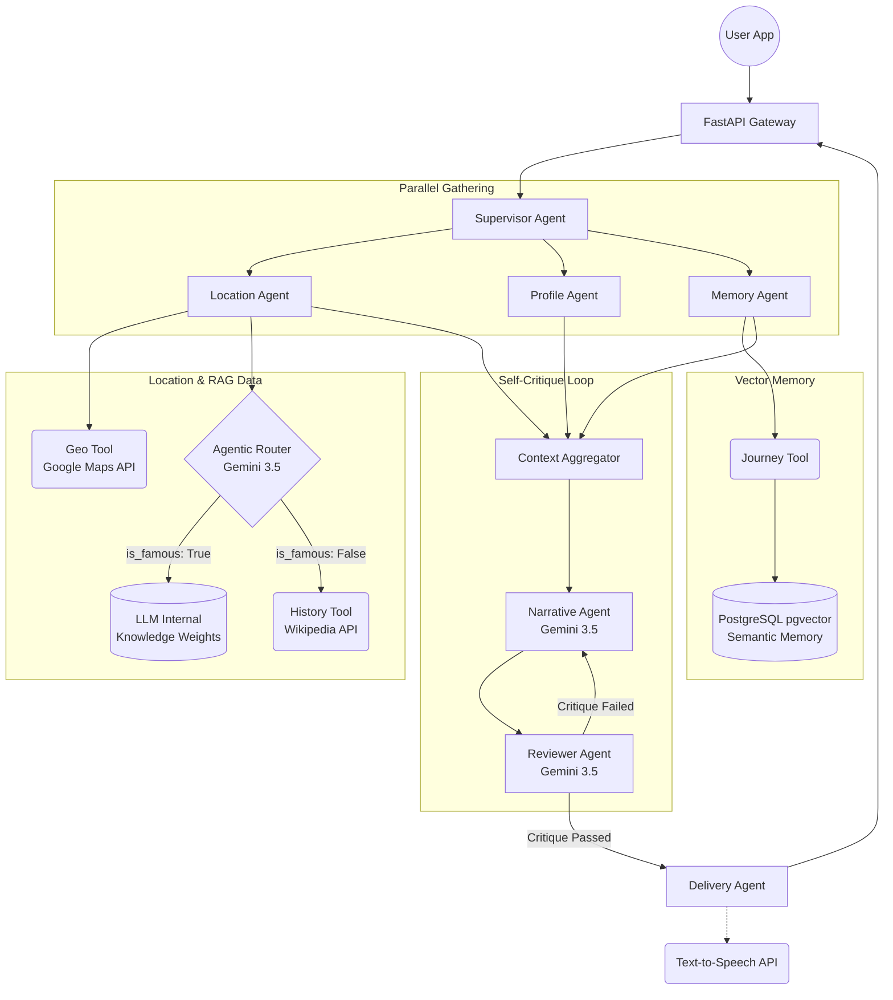

# ChronoPath AI

ChronoPath AI is a highly advanced, agentic orchestration platform designed to generate hyper-personalized, historically accurate, and contextually rich narratives based on a user's geographical location. It moves beyond standard prompt-engineering by utilizing a custom Agent Development Kit (ADK), Agentic RAG routing, Vector-based semantic memory, and autonomous self-critique loops.

## Technology Stack

### Application & Orchestration
- **Framework:** Custom Google-ADK (Agent Development Kit) for multi-agent graph routing.
- **Backend:** FastAPI (Python 3.13) for high-performance, asynchronous endpoints.
- **LLM Engine:** Google Gemini (via `google-genai`), specifically `gemini-3.5-flash`.

### Database & Memory
- **Primary Database:** PostgreSQL 16
- **Vector Search:** `pgvector` (L2 distance semantic search for user travel memories)
- **Database Driver:** `asyncpg` / `sqlalchemy[asyncio]`
- **Caching & State:** Redis

### External Integrations & APIs
- **Geocoding & Places:** Google Maps API (`googlemaps`)
- **Historical Data:** Wikipedia / Wikidata REST APIs (via `httpx`)
- **Text-to-Speech:** Google Cloud Text-to-Speech API

---

## Core Functionalities

1. **Hyper-Personalization:** Tailors narratives based on user demographics (e.g., explaining history differently to a 10-year-old vs. a PhD historian).
2. **Agentic RAG Routing:** Dynamically evaluates whether it needs to fetch external data (Wikipedia) or if it can rely on internal LLM knowledge, drastically reducing latency for famous landmarks.
3. **Semantic Memory (Vector RAG):** Translates past user journeys into vector embeddings. When visiting a new location, it semantically searches past trips to draw poetic analogies (e.g., comparing Roman ruins in France to ones they saw in Italy).
4. **Autonomous Self-Critique:** Features a "Reviewer Agent" that critiques generated stories against strict JSON schemas and tone guidelines, forcing rewrites before the user ever sees the text.

---

## System Architecture

The `/generate` endpoint triggers the `SupervisorAgent`, which coordinates a complex execution graph:



---

## API Contract

`POST /generate`

**Request:**
```json
{
  "user_id": "1",
  "latitude": 18.5196,
  "longitude": 73.8553
}
```

**Response:**
```json
{
  "request_id": "123e4567-e89b-12d3-a456-426614174000",
  "place": "Shaniwar Wada",
  "text": {
    "title": "Shaniwar Wada - Peshwa Era",
    "story": "..."
  },
  "safe": true
}
```

---

## Local Development

**Run Tests:**
```bash
python -m pytest tests/
```

**Run API Server Locally:**
```bash
uvicorn api.main:app --reload
```

**Run via Docker Compose:**
*(Includes PostgreSQL, pgvector, and Redis)*
```bash
docker compose up --build
```

**Test the Endpoint:**
```bash
curl -X POST http://localhost:8000/generate \
  -H "Content-Type: application/json" \
  -d "{\"user_id\":\"1\",\"latitude\":18.5196,\"longitude\":73.8553}"
```

## Configuration

Copy `.env.example` to `.env` and provide real credentials (`GOOGLE_API_KEY`, etc.) before enabling production integrations.
