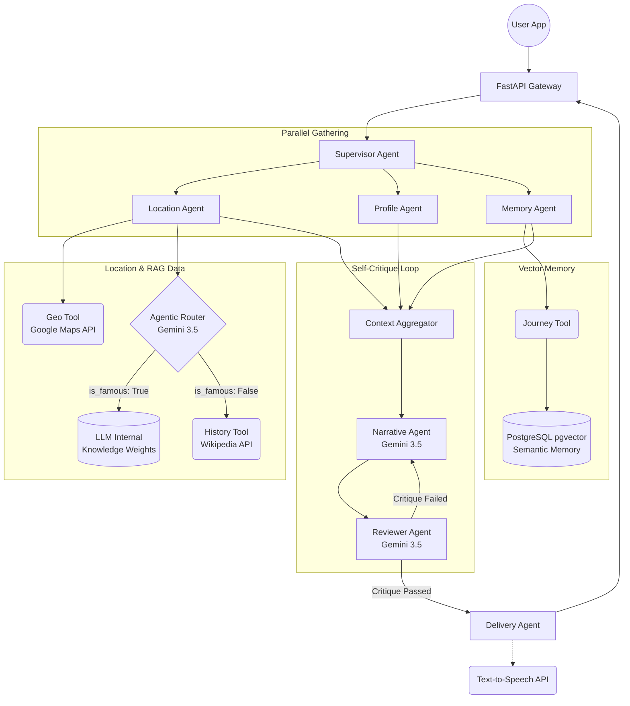

# ChronoPath AI: System Architecture

The ChronoPath system utilizes a multi-agent orchestration pattern (via ADK). The architecture is designed to rapidly ingest geographical data, apply Agentic RAG to selectively fetch historical context, and use a self-critique Feedback Loop to generate high-fidelity, hyper-personalized historical narratives.

Below is the complete end-to-end System Design diagram:

### Core Architectural Concepts

1. **Agentic Router (Phase 1 RAG):** 
   Notice the `Agentic Router` block. Before ChronoPath blindly requests Wikipedia data, it consults a lightweight LLM router. If the user is at a world-famous location (e.g., The Colosseum), it routes directly to the LLM's internal weights, shaving seconds off the latency. If it's obscure, it falls back to external APIs.
   
2. **Semantic Vector Memory (Phase 2 RAG):**
   The `Journey Tool` now calculates text embeddings for every generated story and stores them in `pgvector`. When a user visits a new location, the system queries this database using semantic similarity (`<->`) to inject highly personalized analogies based on their past travel history.

3. **Self-Critique Generation:**
   The `Narrative Agent` generates the first draft, which is immediately checked by a `Reviewer Agent` (acting as a harsh critic). If the narrative violates tone rules or lacks historical accuracy, it forces the Narrative agent to rewrite it—all happening autonomously before the user sees the output.

4. **ADK Parallel Orchestration:**
   The data gathering agents (Location, Profile, Memory) execute completely in parallel using `ParallelRunner`, meaning database lookups and API calls do not block each other, drastically reducing cold-start latency.
